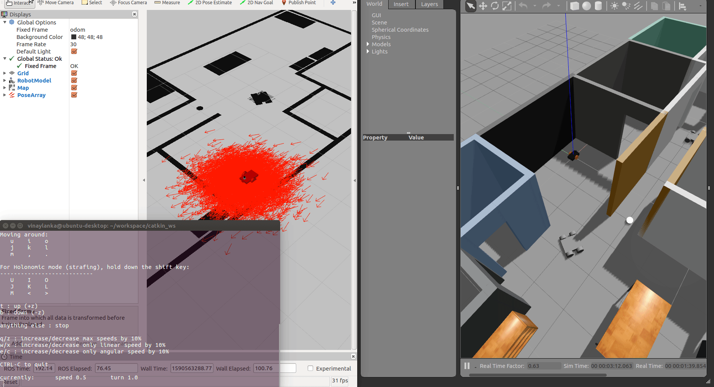

# Adaptive Monte Carlo Localization implementation (ROS)
## Introduction
AMCL is a probabilistic localization system for a robot moving in 2D. It implements the Adaptive Monte Carlo localization approach, which uses a particle filter to track the pose of a robot against a known map. 
A repository containing files required for the environment, robot and functionality of a ball chasing robot.

**AMCL in action** (check /media for more screenshots)

## Setup

**Requires ROS and Gazebo to be installed**
(A guide for installation can be found [here](http://wiki.ros.org/ROS/Installation))

This repository contains 2 packages for the amcl implemetation - 
- **my_robot** - Contains all the required files for the robot and the world in the gazebo environment, including an amcl file for parameters.
- **(Optional) Teleop keyboard** - Package to control the robot with a keyboard.

### Building
Clone the repository in your src folder of your catkin env.  
After running `catkin_make`, source your setup files and you're good to go.

## Usage

To start the gazebo + rviz sim, launch a new terminal and run:  

`roslaunch my_robot world.launch`

Now open another terminal and run  
` roslaunch my_robot amcl.launch`

In rviz -> Add 3 components in the Add menu = Robot Model, Map and PoseArray. 
Initialise them with their respective topics(/map,/particlecloud).

Now open another terminal and run  
` rosrun teleop_twist_keyboard teleop_twist_keyboard.py`

Follow the instructions in the terminal to control the robot and watch the amcl algorithm localise your robot within seconds!

If you wish to tune paramenters, check the `  amcl.launch` file to edit.